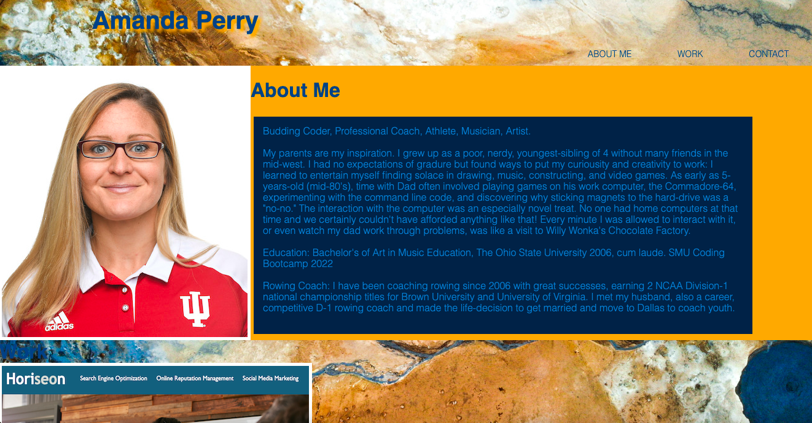

# ap_portfolio

# about

This portfolio shows works from Horiseon and Run Buddy with a placeholder "Robot Gladiators" for a future project, which is currently linked to a youtube music video of "The Humans Are Dead" by Flight of the Concords for a bit of added levity. 

This project was especially tough for me in building from scratch. The page is still not in the form I had fully envisioned but I'm out of time! I really enjoyed searching for tutorials and finding a variety of excellent if not distracting ideas for such a project which may display one's creativity.  This rabbit-hole lead me to the transition ease-in-out feature that is very fun to play with; the sticky header affixed at the top with that marbled background were particularly fun, if not again, entirely distracting. 

Challenges for me involved when and how to use flex-box and the miriad of layers that can crisscross in css and classes. 

I very much wanted to add in mediaqueries but ran out of time there too. This project has really tought me a lot, if not just in the process of managing how to move forward. 

# screenshot

